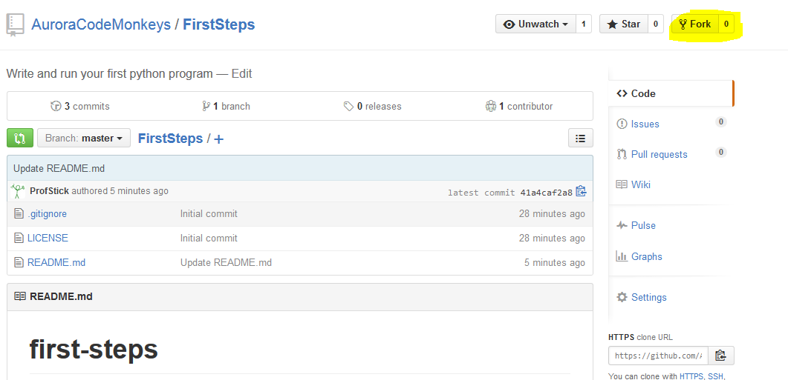
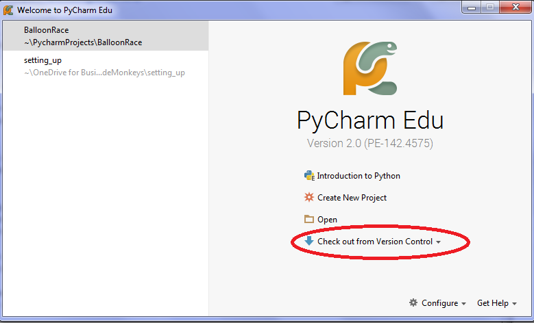
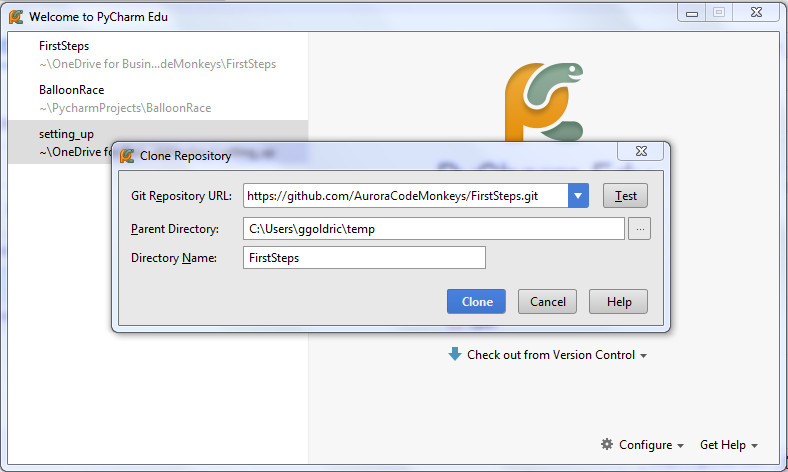
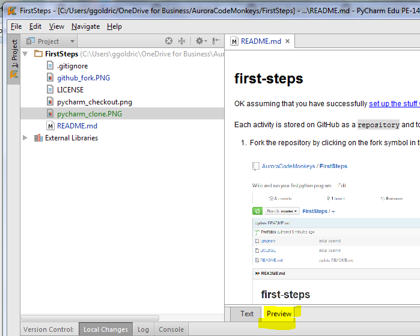

# first-steps
OK assuming that you have successfully [set up the stuff you need to become a code monkey](https://github.com/AuroraCodeMonkeys/GettingStarted), now its time to start writing code.

Each activity is stored on GitHub as a `repository` and to complete the activity you need to:

1. Fork the repository by clicking on the fork symbol in the top right-hand corer of the repository home page.<br><br>
   <br><br><br>

1. Open PyCharm and at the *Welcome screen* choose `check out from version control`<br><br>
   <br><br><br>
   
1. From the drop down list choose GitHub then in the Clone Repository dialog choose the repository you would like to 
clone (ie copy to your computer) and the directory you would like to copy it to.<br><br>
   <br><br><br>

1. Once you have opened the activity, double click on the README.md file to open it, switch to the preview tab to
display the formatted file and follow the directions.<br><br>
   <br><br><br>
   
   **Note: you will get a better formatted README file with pretty code formatting and better resolution pictures if you 
   just read it in GitHub rather than in PyCharm.But it does mean you will have to be constantly switching between your 
   browser and PyCharm to do the coding activity.**

##Finally its time to code
Our first program isn't going to be very exciting but it will allow me to make sure that you have everything set up
properly. Double-click on the file first_steps.py to open it in an editor. The code should look like this.<br><br>

```python
__author__ = 'Your Name'

# this bit is just to let me check you have set up pygame properly
# so just ignore it
import pygame as P
P.init()

# add your code below here
```
  
ignore the first 8 lines and add the following code to line 9. Replace the elipse (...) 
with the message you would like to send to the world.<br><br>

```python
print('my message to the world is ...')
```
